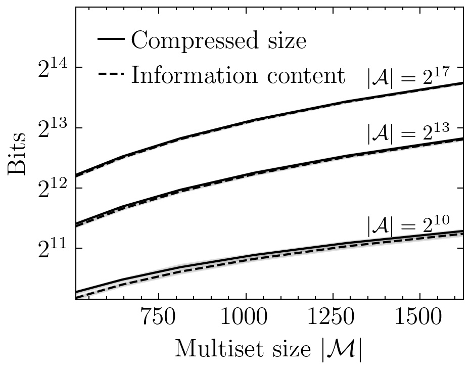
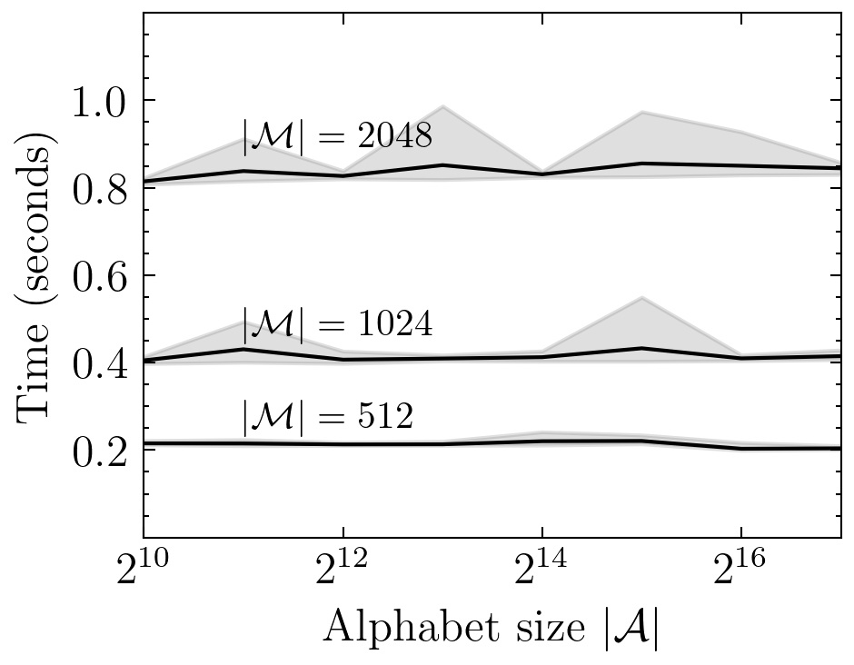
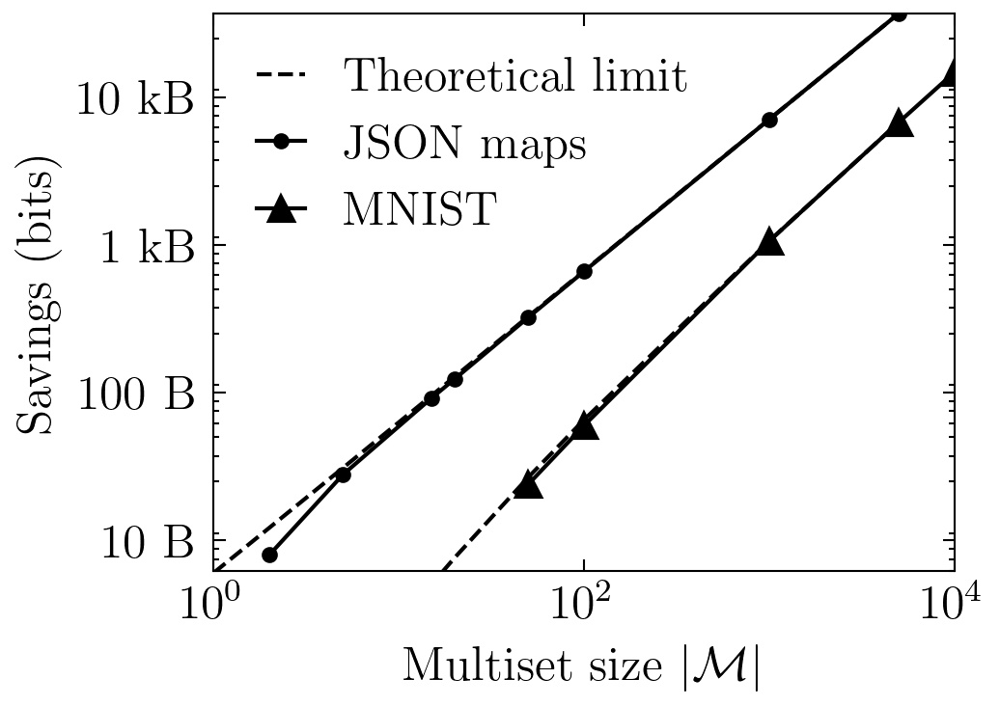
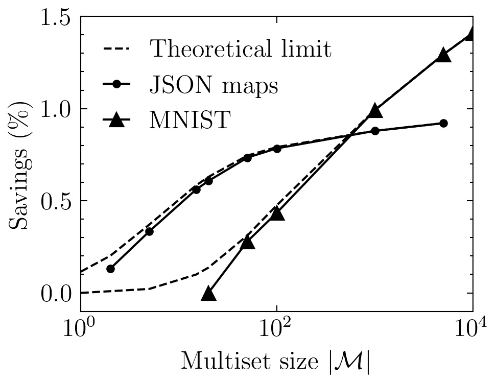

# Compressing Multisets with Large Alphabets
[](https://arxiv.org/abs/2107.09202)
[](https://github.com/facebookresearch/multiset-compression/actions/workflows/tests.yml)

[Daniel Severo](https://dsevero.com)\*, [James Townsend](https://j-towns.github.io/)\*, [Ashish Khisti](https://www.ece.utoronto.ca/people/khisti-a/), [Alireza Makhzani](http://www.alireza.ai/), and [Karen Ullrich](https://karenullrich.info/)

\* denotes equal contribution to both the paper and the code in this repository.

This repository contains the official code that accompanies the arXiv paper.

---
A structured data source can often be compressed efficiently by treating it as an ordered sequence of symbols drawn from some alphabet.  However, there are data types where the relative order of the symbols is irrelevant, such as collections of files, rows in a database, or nodes in a graph. Formally, these are known as _multisets_: a generalization of a set that allows for repetition of elements.

The method outlined in the paper can convert off-the-shelf _lossless_ compression algorithms, originally built for ordered sequences, into a lossless compression algorithm for multisets. Essentially, it can _forget the ordering_ between symbols to save bits. 

To achieve this, our method relies heavily on another lossless codec called _ANS: Asymmetric Numeral Systems_ (Duda, 2009), as well as the idea of invertible sampling known as _Bits-back coding_ (Frey, 1997; Townsend et. al 2019). The ANS implementation used in this project is the one available in the [Craystack](https://github.com/j-towns/craystack) package.

---

In this repo, you will find simple illustrative examples such as

* [Multiset Codec](#multiset-codec)
* [Invertible Sampling without Replacement Codec](#invertible-sampling-without-replacement-codec)

End-to-end experiments with the following datasets

* [Toy multisets](experiments/toy_multisets.py)
* [Lossy MNIST images](experiments/mnist_lossy.py)
* [Collection of JSON maps](experiments/jsonmaps.py)

A detailed explanation of the data-structure underlying our multiset implementation

* [Multiset-BST datastructure](#Multiset-BST-datastructure)

How to compress multisets of custom symbols by overriding Python comparison operators

* [Compressing multisets of custom symbols](#Compressing-multisets-of-custom-symbols)

And, finally, [how to properly cite our work](#how-to-cite).

## Main codecs

There are 2 main codecs: `Multiset` and `SamplingWithoutReplacement`; as well other auxiliary codecs: `Uniform`, `ByteArray`, `Categorical`, `Sequence`, and `VariableLengthSequence`. All are available at [`multiset_codec/codecs.py`](multiset_codec/codecs.py).

Using the codecs requires installing Craystack, and multiset-compression
```bash
# Install craystack
pip install git+https://github.com/j-towns/craystack.git

# Install multiset-compression
pip install .
```

### Multiset codec
The `Multiset` codec can be used to compress multisets represented as the nested tuple tree outlined in [Multiset-BST datastructure](#Multiset-BST-datastructure). It is possible to build multisets from any sequence-like object via `build_multiset`. 

The codec takes as input a pre-existing symbol codec, originally built for ordered sequences, and converts it to a codec for multisets.

For example,

```python
from multiset_codec import codecs, rans, msbst

multiset = msbst.build_multiset([0, 255, 128, 128])   # Build a BST representing the multiset

ans_state = rans.base_message(shape=(1,))             # Vectorized ANS state
symbol_codec = codecs.Uniform(256)                    # Craystack codec with Uniform(1/256)
multiset_codec = codecs.Multiset(symbol_codec)        # Initialize multiset codec

(ans_state,) = \
    multiset_codec.encode(ans_state, multiset)        # Encode multiset

(ans_state, multiset_decoded) = \
    multiset_codec.decode(ans_state, multiset_size=4) # Decode multiset

assert msbst.check_multiset_equality(multiset, multiset_decoded)
```

For an analysis of bit-savings from using our method versus compressing the multiset as a sequence (i.e. with the symbol codec alone), please see the experiments section of our paper.

### Invertible Sampling without Replacement Codec
The `Multiset` codec samples symbols from the multiset, without replacement, and encodes them with the symbol codec. Sampling reduces the size of the final compressed state (i.e. saves bits), as it is implemented with an ANS-decode operation (i.e. bits-back coding). 

To perform the sampling operation, `Multiset` uses the `SamplingWithoutReplacement` (SWOR) codec from `multiset_codec/codecs.py`. SWOR is a stand-alone codec, and can therefore be used to perform sampling for other tasks.

For example,

```python
from multiset_codec import codecs, rans, msbst

multiset = msbst.build_multiset('utoronto')           # Build a BST representing the multiset

ans_state = rans.base_message(shape=(1,))             # Vectorized ANS state

swor_codec = codecs.SamplingWithoutReplacement()      # Init. SWOR codec

(ans_state, symbol, submultiset) = \
    swor_codec.decode(ans_state, multiset)            # SWOR, symbol == 'n'

(ans_state, multiset_restored) = \
    swor_codec.encode(ans_state, symbol, submultiset) # Invert SWOR

assert msbst.check_multiset_equality(multiset, multiset_restored)
```

## Compressing multisets of custom symbols
A multiset can be constructed from any collection of symbols that are _comparable_. In Python, this translates to any object of a class that implements the comparison operators `<` and `>` via the methods `__lt__` and `__gt__`.

For example, consider a multiset of integer 1d-arrays of variable-length. A lexicographical ordering between arrays, induced by their binary representations, is implemented in the `ArraySymbol(arr: np.ndarray)` class, as shown below. 

```python
from multiset_codec import msbst

import numpy as np

max_int = 42
max_array_size = 20

class ArraySymbol:
    def __init__(self, arr: np.ndarray):
        self.arr = arr
    
    def __lt__(self, other: np.ndarray):
        return self.arr.tobytes() < other.arr.tobytes()
        
    def __gt__(self, other: np.ndarray):
        return self.arr.tobytes() > other.arr.tobytes()
        
multiset = msbst.build_multiset([
    # Random ndarrays
    ArraySymbol(np.random.randint(max_int, size=5)),
    ArraySymbol(np.random.randint(max_int, size=2)),
    
    # Duplicates
    ArraySymbol(np.ones(max_array_size)),
    ArraySymbol(np.ones(max_array_size)),
])
```

To compress the multiset, a codec for `AdaptiveSymbol` must be implemented, such as the [`ByteArray`](https://github.com/dsevero/bb-multisets/blob/f1128bf1148351c36b0523cf8ec9ea30be22249a/multiset_codec/codecs.py#L125) codec used in the [Lossy MNIST experiment](experiments/mnist_lossy.py). Alternatively, if the class is extended to include the methods `__len__` and `__getitem__`, then the [`VariableLengthSequence`](https://github.com/dsevero/bb-multisets/blob/arxiv/multiset_codec/codecs.py#L183-L203) codec can also be used.

## Internals
### Multiset-BST datastructure
The underlying data-structure of our multiset is a binary search tree (BST), implemented in pure Python as a nested tuple tree. 

The tuple has 4 elements, which are 

- `count`, the total number of symbols in the branch, including the root node;
- `symbol`, the symbol at the root node;
- `left_multiset`, the sub-multiset with elements smaller than `symbol`;
- `right_multiset`, the sub-multiset with elements larger than `symbol`.

There are 2 functions that can insert and remove elements in the multiset immutably

- `insert: (multiset, symbol) -> multiset'`
- `remove: (multiset, symbol) -> multiset'`

For example,

```python
from multiset_codec.msbst import insert, remove

# Empty multiset
multiset = () 

# Insert elements into multiset
for symbol in 'babc':
    multiset = insert(multiset, symbol)

count, symbol, left_multiset, right_multiset = multiset
# -----------------------------------------------------
# (4,                <-- count 
#  'b',              <-- symbol
#  (1, 'a', (), ()), <-- left_multiset
#  (1, 'c', (), ())) <-- right_multiset

count, symbol, left_multiset, right_multiset = remove(multiset, 'a')
# ------------------------------------------------------------------
# (3,                <-- count 
#  'b',              <-- symbol
#  (),               <-- left_multiset (empty)
#  (1, 'c', (), ())) <-- right_multiset
```

The compute times of both `insert` and `remove` depends on the depth of the tree. To build a balanced tree, we can sort the sequence before performing insertions. This functionality, together with the necessary insertion operations, is available via `build_multiset`

```python
from multiset_codec.msbst import build_multiset

multiset = build_multiset([1, 3, 3, 7])
```

To perform ANS encode and decode, the codecs in `multiset_codec.codecs` require the following functions (see the paper for more detail)

- `forward_lookup: (multiset, symbol) -> (start, freq)`
- `reverse_lookup: (multiset, idx) -> (start, freq), symbol`

where `start` and `freq` are the cumulative and frequency counts of the `symbol` at `idx`. In short, both are variations of a [search operation](https://en.wikipedia.org/wiki/Binary_search_tree#Searching_with_duplicates_allowed) on the BST.

For example,

```python
from multiset_codec.msbst import build_multiset, forward_lookup, reverse_lookup

sequence = 'abbcccde'
multiset = build_multiset(sequence)

start, freq = forward_lookup(multiset, 'c')
# start, freq == 3, 3
# sequence[start:start+freq] == 'ccc'

start, freq = forward_lookup(remove(multiset, 'a'), 'c')
# start, freq == 2, 3
# sequence[start:start+freq] == 'ccc'

idx = 2
(start, freq), symbol = reverse_lookup(multiset, idx)
# start, freq, symbol == 1, 2, 'b'
# sequence[idx] == symbol
```

## Repository Structure
Below is the repo structure. Please see each file for detailed comments.
```
.
├── custom.mplstyle         # Matplotlib custom style file
├── data/
│   ├── github-users.jsonl  # JSON maps dataset
│   └── mnist.npz           # MNIST test set
├── experiments/
│   ├── jsonmaps.py         # JSON maps experiment
│   ├── mnist_lossy.py      # Lossy MNIST experiment
│   └── toy_multisets.py    # Toy multisets experiment
├── figures/
├── multiset_codec/
│   ├── codecs.py           # Craystack implementation of multiple codecs
│   ├── msbst.py            # BST implementation of a multiset
│   └── rans.py             # Vectorized rANS, adapted from Craystack
├── plots.py                # Generates all plots in figures/
├── README.md
├── plots-requirements.txt
├── tests/
│   ├── test_experiments.py
│   ├── test_msbst.py
│   ├── test_rans.py
│   └── test_utils.py
└── utils.py                # Contains miscellaneous helper functions
```

## Generate plots
Perform the setupt at [Multiset Codec](#multiset-codec) followed by
```bash
# Install the required packages: matplotlib, numpy, scipy, pandas, joblib, and Pillow
pip install -r plots-requirements.txt
```

Then, run the following to generate all plots. Experiments will be called from the `experiments/` directory, and results will be cached to `.cache`.
```bash
python plots.py
```

Plots will be saved to `figures/`, and should appear on-screen.

<p align="middle">
  
   
  
   
</p>

## Testing
```bash
pip install pytest joblib pandas Pillow
python -m pytest -v tests/
```

## License

multiset-compression is MIT licensed, as found in the [LICENSE](LICENSE) file.

Here is more information about [terms of use](https://opensource.facebook.com/legal/terms) and the [privacy policy](https://opensource.facebook.com/legal/privacy)

## How to cite
```bib
@misc{severo2021compressing,
    title={Compressing Multisets with Large Alphabets},
    author={Daniel Severo and James Townsend and Ashish Khisti and Alireza Makhzani and Karen Ullrich},
    year={2021},
    eprint={2107.09202},
    archivePrefix={arXiv},
    primaryClass={cs.IT}
}
```
